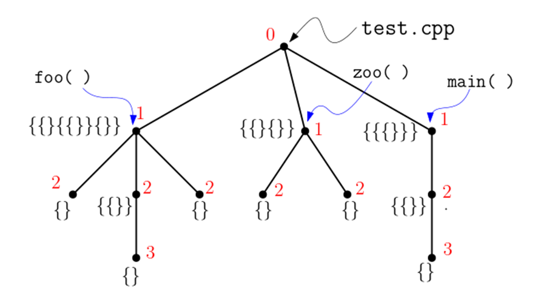

# 문제

source code의 복잡도를 계산하는 것은 소프트웨어 공학에서 중요한 연구주제 중 하나이다. 이것을 기준으로 지나치게 복잡한 코드는 팩토링(factoring)등을 통하여 그 구조를 개선하고, 또 이 기준으로 소프트웨어 개발비용을 산정하기도 한다. 현재까지 연구된 코드 복잡도 측도(metric)는 매우 다양하다. 이번 문제에서 우리는 BLOCK metric을 사용하여 코드(C/C++)의 복잡도를 계산한다.

C/C++에서 다른 모든 token의 제거하고 '{', '}‘로 구성된 string으로 변환한다. 따라서 source는 중첩블록 구조로 reduce 되며 이는 다시 rooted tree로 표현된다. 예를 들어 아래의 test.cpp를 BLOCK string으로 변환하면 다음과 같다.

```cpp
void foo() {
    for(i) {
        .....
    }
    if() {
        for(j) {
            ...
        }   // for j
    }   // end if
    else {
    }   // end else
    ...
}   // end of foo()

int zoo() {
    {  };
    {  };
}   // end of zoo()

int main() {
    for() {
        while() {
            ....
            foo();
        }   // end while
    }   // end of for
}   // end of main()
```

```
{ { } { { } } { } }  { { } { } }  { { { } } }
<------foo()------>  <--zoo()-->  <--main()-->
```

위 BLOCK code를 Tree로 구성하면 다음과 같다. 이를 위해서 가상의 root를 하나 추가한다. 그리고 하나의 단위 BLOCK '{ }'은 leaf node가 되고 그 특정 brace안에 포함된 모든 subbrace Block은 해당 root의 subtree가 된다.

입력된 코드의 복잡도(code complexity)는 해당 코드의 BLOCK tree의 모든 노드의 depth의 합(sum)으로 계산된다. root의 depth는 0이며 depth 인 node의 children(자식노드)의 depth는 로 계산된다. 따라서 블럭이 많을수록, 그리고 그 중첩된 정도가 깊을수록 복잡도 값은 증가한다.



이 경우 foo( )의 복잡도는 1+3\*2+3 = 10이며, zoo( )의 복잡도는 5, main( )의 복잡도는 6이며 코드 test.cpp의 전체 복잡도는 각 함수 복잡도의 합인 10+5+6=21로 계산된다.

# 입출력

입출력은 표준 입출력을 사용한다. 입력 파일은 이전 과제에서 수강생이 제출한 source code이다. 단 source code에서 "xxx"로 표시된 string은 없다. 왜냐하면 string안에 ’{‘, ’}‘가 포함되어 있으면 전처리를 통하여 이것은 제외해야 하기 때문이다. 그리고 처리를 위하여 한글 comment는 없다. 여러분은 source code를 char 단위로 읽어 ’{‘ ’}‘만을 추출하여 BLOCK string을 만든 다음에 이 BLOCK tree의 복잡도를 계산하여 정수로 출력해야 한다. 입력 source code는 최대 1000 line이며 컴파일 오류는 없는 code이다.

## stdin

```
void foo() {
    for(i) {
        .....
    }
    if() {
        for(j) {
            ...
        }   // for j
    }   // end if
    else {
    }   // end else
    ...
}   // end of foo()

int zoo() {
    {  };
    {  };
}   // end of zoo()

int main() {
    for() {
        while() {
            ....
            foo();
        }   // end while
    }   // end of for
}   // end of main()
```

## stdout

```
21
```
