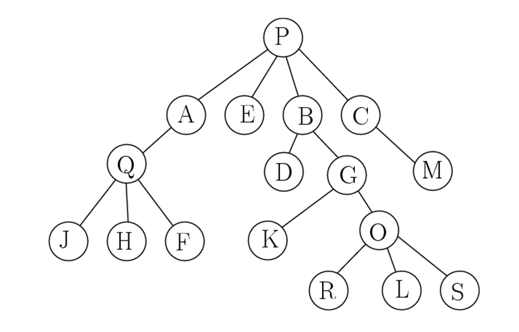

# 문제

마피아(mafia) 조직은 보통 Tree 구조로 운영된다. 즉 최종 보스가 아닌 모든 조직원은 단 한 명의 직속 상관만 존재한다. 일반적으로 마피아에서 최고 권력자는 Boss(보스), 그 다음 서열 2위는 UnderBoss (언더보스)라고 불리며 실질적으로 조직을 관리한다. 보스가 사망하거나 체포될 경우를 대비하여 그 중 한 명이 보스가 된다. 서열 3위는 카포레지메(Caporegime), 줄여서 Capo(카포)라고 불리며 하부 독립된 조직을 운용하는 ‘행동대장’이다. 서열 4위는 솔다토(Soldato, 영어로는 Soldier)며 정기적으로 급여를 받는 정식 사원으로 대우를 받는다. 서열 5위는 Associate (어소시에이트)라고 불리는 비정식 인턴(?) 조직원이다. 그 외 콘실리에리(Consigliere)로 불리는 자문 그룹도 있다. 우리는 마피아의 Tree 구조를 활용하여 모든 조직원에 대하여 그 실질적인 서열(ranking)을 아래 3가지 규칙에 따라서 매길 수 있다. 아래 rooted tree에서 상하 관계 parents, child 관계는 직속 관계를 나타낸다. 아래쪽이 부하다. 그 서열 규칙을 위한 우선순위는 다음과 같다.

1. 자신 관할 아래 하위(subtree) 부하직원이 많을수록 순위가 높다.
2. 부하직원의 수가 같다면 root, 즉 Boss에 가까울수록 순위가 높다.
3. 만일 위의 두 조건이 같다면 이름의 사전식 순서가 빠를수록 더 높다.



만일 위와 같은 경우라면 서열 1위는 가장 많은 부하를 가진 P이다. 따라서 서열 1위는 항상 root가 될 수 밖에 없다. 다음 서열 2위는 7명의 부하를 가진 B가 된다. 3위는 5명의 부하를 가진 G, 4위는 4명의 부하를 가진 A가 된다. 그 다음 순위는 3명의 부하를 가진 두 명의 조직원이 {Q, O} 2명이므로 이 둘에서 다시 서열을 가려야 한다. 이 경우 규칙2)에 의해서 Q가 O보다 root에 더 가까우므로 Q가 5위, O가 6위가 된다. 끝으로 부하가 없는 최하위 말단(terminal) 우리나라의 경우에 대입하면 “시다바리”라고 할 수 있다.

조직원은 3명으로 {R, L, S}이다. 이들은 root로 부터의 거리, 즉 깊이(depth)가 같으므로 그 이름의 알파벳에 따라서 L, R, S 순서가 정리된다.

# 입출력

입출력은 표준 입출력을 사용한다. 입력 파일은 이전 과제에서 수강생이 제출한 source code이다. 단 source code에서 "xxx"로 표시된 string은 없다. 왜냐하면 string안에 ’{‘, ’}‘가 포함되어 있으면 전처리를 통하여 이것은 제외해야 하기 때문이다. 그리고 처리를 위하여 한글 comment는 없다. 여러분은 source code를 char 단위로 읽어 ’{‘ ’}‘만을 추출하여 BLOCK string을 만든 다음에 이 BLOCK tree의 복잡도를 계산하여 정수로 출력해야 한다. 입력 source code는 최대 1000 line이며 컴파일 오류는 없는 code이다.

## stdin1

```
17
D B
G B
M C
A P
Q A
B P
J Q
C P
L O
H Q
F Q
K G
O G
R O
E P
S O
```

## stdout1

```
P
B
G
A
Q
O
C
E
D
M
F
H
J
K
L
R
S
```

## stdin2

```
12
Ezar Lachlan
Aceson Lachlan
Pascual Nanea
Selene Pascual
Juliann Shelby
Lachlan Abem
Kaian Abem
Abem Nanea
Haidyn Lachlan
Shelby Pascual
Solaris Haidyn
```

## stdout2

```
Nanea
Abem
Lachlan
Pascual
Shelby
Haidyn
Kaian
Selene
Aceson
Ezar
Juliann
Solaris
```
